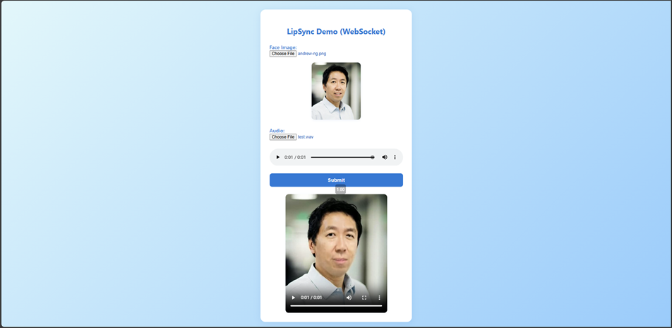

# Real-time Lip-syncing WebSocket API

## Description

This project provides a real-time lip-syncing API using WebSockets, powered by the Wav2Lip model. Users can upload a face image and an audio file, and receive a lip-synced video in response. The backend is built with FastAPI and leverages deep learning models for accurate and high-quality lip synchronization.

## Features

- Real-time lip-syncing via WebSocket API
- Supports image and audio file uploads
- Returns generated video with synchronized lips
- Easy-to-use web frontend for quick testing
- Powered by the state-of-the-art [Wav2Lip model](https://github.com/Rudrabha/Wav2Lip)

## How It Works

1. The client sends a face image and an audio file (both base64-encoded) to the WebSocket endpoint.
2. The backend receives the data, processes it with the Wav2Lip model, and generates a video with synchronized lips.
3. The server responds with a base64-encoded video file.
4. The client decodes and displays or saves the video.

## Project Architecture
```
wav2lip-fastapi-app/
├── app/
│   ├── main.py              # FastAPI entry point and route definitions
│   ├── api/                 # API route handlers
│   ├── services/            # Core business logic and processing
│   ├── models/              # Deep learning models (including Wav2Lip)
│   └── utils/               # Utility functions and helpers
├── checkpoints/             # Pre-trained model weights (e.g., Wav2Lip.pth)
├── static/                  # Web-based demo client
├── tests/                   # Testing the WebSocket API
├── pyproject.toml           # Python dependencies and project metadata
├── uv.lock                  # Locked dependency versions for uv
├── docker-compose.yml       # Docker Compose configuration
├── Dockerfile               # Docker build instructions
└── README.md                # Project documentation
```

## Installation

1. **Clone the repository:**
   ```sh
   git clone https://github.com/TTNamUS/wav2lip-fastapi-app.git
   cd wav2lip-fastapi-app
   ```

2. **Install dependencies:**  
    - Install [uv](https://github.com/astral-sh/uv) (Python package manager)
        ```sh
        pip install uv
        ```

    - Setup dependencies from `pyproject.toml`
        ```sh
        uv sync
        ```

3. **Download the Wav2Lip model checkpoint:**
   - Place the `Wav2Lip.pth` file in the `checkpoints/` directory.
   - See [checkpoints/README.md](checkpoints/README.md) for details.

4. **Start the server:**
   ```sh
   uvicorn app.main:app --host 0.0.0.0 --port 8000
   ```

5. **Access the web demo:**
   - Open [http://localhost:8000](http://localhost:8000) in your browser.

## Running with Docker
```sh
# Build and start with Docker
docker-compose up --build

# Open your browser and go to web demo:
http://localhost:8000
```

### Frontend Demo
Face Image: [andrew-ng.png](tests/andrew-ng.png)  
Audio: [test.wav](tests/test.wav)  

=> Output: [output.mp4](tests/output.mp4)


## Usage

### WebSocket API

- **Endpoint:** `/ws/lipsync`
- **Protocol:** WebSocket

**Request Payload:**
```json
{
  "base64_image": "<base64-encoded image>",
  "base64_audio": "<base64-encoded audio>"
}
```

**Response:**
- On success: `{ "status": "success", "video": "<base64-encoded mp4>" }`
- On error: `{ "status": "error", "detail": "<error message>" }`

### Example - Testing with test.py

You can use the provided [tests/test.py](tests/test.py) script to test the WebSocket API.

**Usage:**

```sh
uv run test.py
```

## Future Work
- **Improved Error Handling:** Provide more detailed error messages and robust handling of edge cases (e.g., corrupted files, unsupported formats).
- **API Documentation:** Expand and improve API documentation with OpenAPI/Swagger and more usage examples.
- **Frontend Enhancements:** Improve the web demo with progress indicators, drag-and-drop support, and better UX/UI.
- **Internationalization:** Add support for multiple languages in the frontend and API responses.
- **Logging & Monitoring:** Integrate advanced logging, monitoring, and alerting for production readiness.
- **Automated Testing & CI/CD:** Add comprehensive unit/integration tests and set up continuous integration/deployment pipelines.
- **Cloud Deployment:** Provide scripts and documentation for seamless deployment on popular cloud platforms (AWS, Azure, GCP).
- **User Authentication & Rate Limiting:** Secure the API with authentication and add rate limiting to prevent abuse.
- **GPU/TPU Acceleration:** Add support for hardware acceleration and automatic device selection.
- **Model Optimization:** Optimize the Wav2Lip model for faster inference and lower resource consumption, possibly via quantization or model distillation.
- **Batch Processing Support:** Enable processing multiple image/audio pairs in a single request for bulk operations.
- **Video Input Support:** Allow users to upload video files (not just static images) for full video-to-video lip-syncing.
- **Speaker Diarization:** Integrate speaker identification to support multi-speaker audio and assign correct lip-sync to each face in group images or videos.
- **Real-time Streaming:** Implement real-time audio/video streaming support for live lip-sync applications.


## Contributing

Contributions are welcome! Please open issues or submit pull requests for improvements and bug fixes.

## License

This project is for research and personal use only. For commercial use, please contact the authors. See [app/models/Wav2Lip/README.md](app/models/Wav2Lip/README.md) for details and citation requirements.